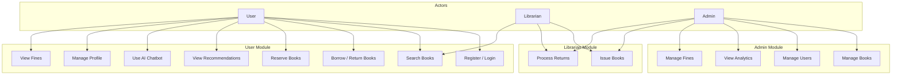
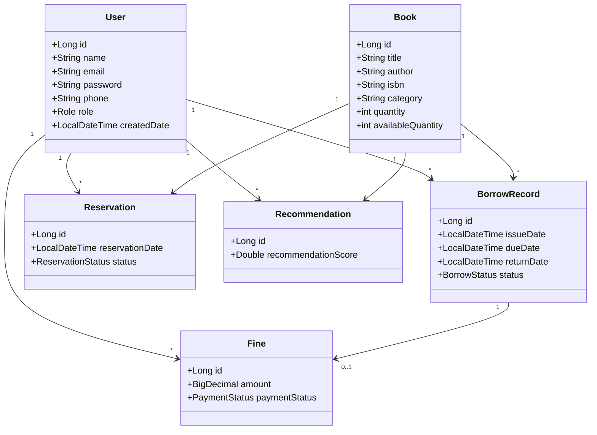
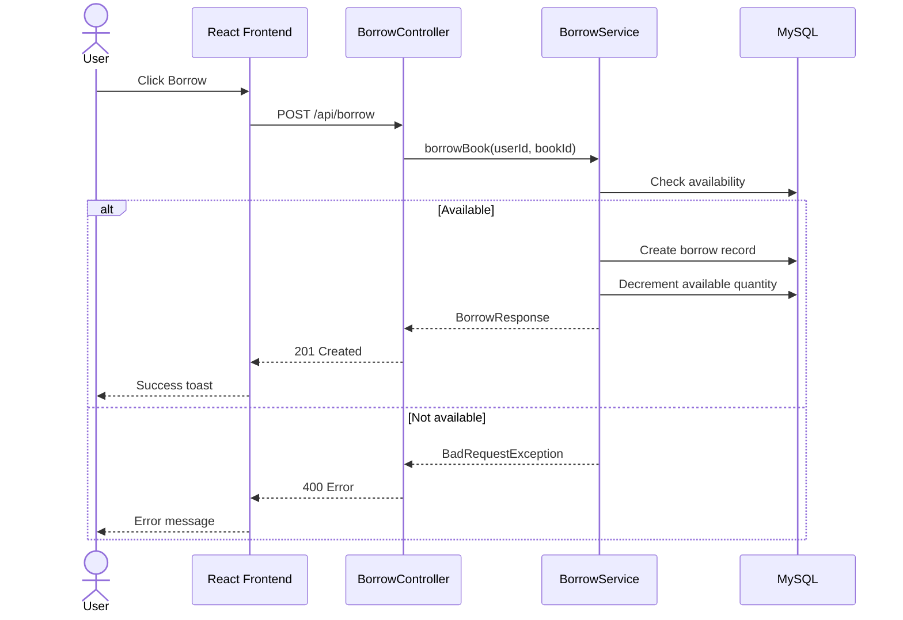
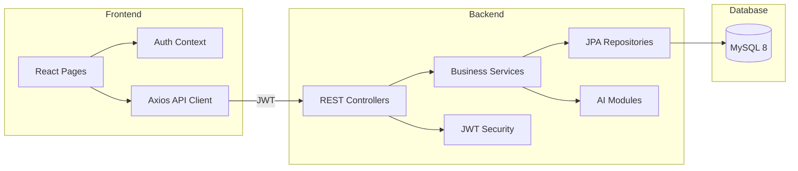
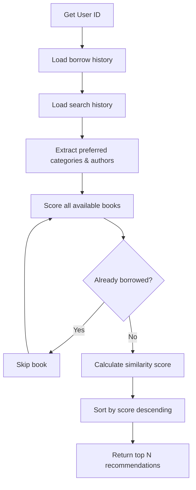

# UML Diagrams - SMARTLIB AI

## 1. Use Case Diagram

## 2. Class Diagram (Core Domain)

## 3. Sequence Diagram - Borrow Book

## 4. Component Diagram

## 5. Activity Diagram - Recommendation Engine

